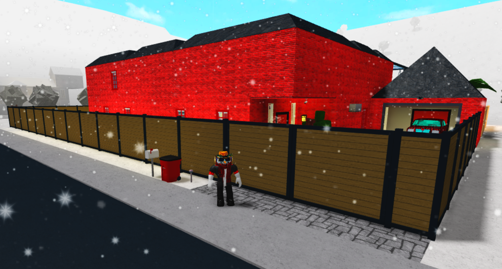

 

In my free time, I have decided to make a house in a game called "Welcome to Bloxburg". The game "Welcome to Bloxburg" is heavily inspired by the game "The sims" where you have to take care of your character while also make a house at the same time. The main focus was to make a house for my character to satisfy my characters needs and give him shelter. The amount of time put into this project took quite a while since it was done in my own free time. 

The house has gone through some changes and difficulties when it came to building the project. Some actions like furniture placement, house layout, and the amount of resources it takes to make the house can hold a good amount of redesign and time consumption. There were some thoughts of redoing the house in other ways to where the thinking process of house decoration and design can be quite overwhelming. How I overcame these type of problems is by taking breaks every now and then from the project, putting the time in and slowly work with what I have in the moment, and branch off from what I have and keep the pace of building from there. 

This house project was done by myself and has taught me skills that can be applied in the future. Some skills that this house project has taught me are Pre-planning and Precision. These two skills can be applied in both real life and in Computer Science. Pre-planning is used to plan out code beforehand like pseudocodes similarly to how drawing blueprints and houseplans are used to draw out an idea of how the house will look like. Precision can be used to carefully code each line with accuracy similar to placing furnitures, spacing certain areas out, and placing walls for a house

If you want a house tour on how it looks, here is the link to the [House tour](https://www.youtube.com/watch?v=bUhYZW8EyqE&feature=youtu.be).

