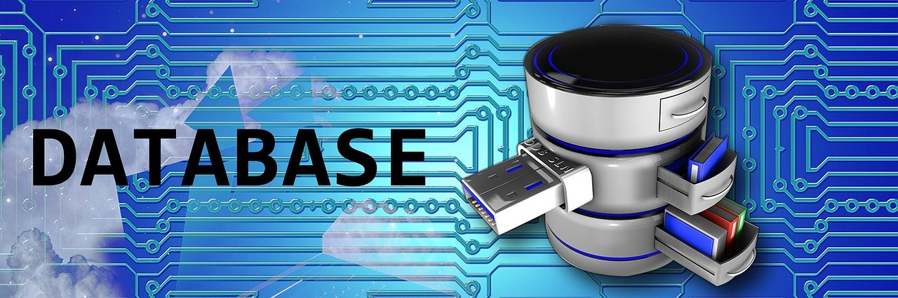

This was the first project that was done for my class in ICS 212. In this project we first had to make the user interface for the user to see and prompts the user to pick the options shown on their screen. They have the option to add record, find record, print all the records, delete records, or to quit the program. I also had to make the database to hold the records that the user decides to create, find, or delete. The entire code was built using C code on unix in vim. 

This project has taught me a lot of skills and assets I can use in the future. It has tested my knowledge of C programming and has taught me a lot on how to be self-directed. Coding the database showed me how linkedlists work and how to get read and write file into my code. It has greatly showed me how to manage my time wisely since this project required a lot of patience and thinking into this project. 

Source code: TBA in the future
