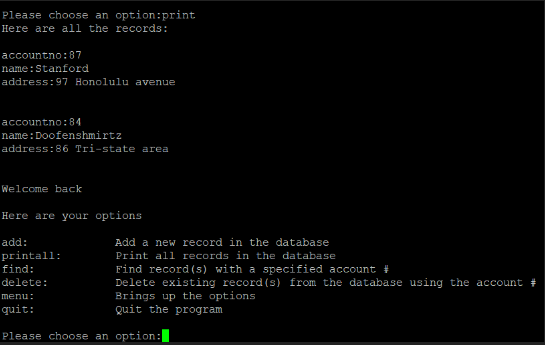

This was the first project that was done for my class in ICS 212. In this project we first had to make the user interface for the user to see and prompt the user to pick the options shown on their screen. They have the option to add records, find records, print all the records, delete records, or to quit the program. I also had to make the database to hold the records that the user decides to create, find, or delete. The entire code was built using C code on unix in vim. 



The picture above is an example of the user-interface.

There were some hardships that I experienced in this project. One of them was self-doubt mainly because of the amount of bugs and problems that have been encountered while learning how to code in C. The concepts in C that gave me the most problems was learning linked lists and memory allocation. This has made me procrastinate and waste more time due to fear of the problems especially since this project has to be done independently without sharing source codes with one another. How I overcame this problem is by doing a lot of research, asking for help on how the concepts of some sample code work like linked lists and memory allocation, and by pushing myself further into solving the problems in order to further enhance my learning in C programming.

This project has taught me a lot of skills and assets I can use in the future. It has tested my knowledge of C programming and has taught me a lot on how to be self-directed. Coding the database showed me how linked lists work and how to get read and write files into my code. It has greatly shown me how to manage my time wisely since this project required a lot of patience and thinking into this project. 

Down below is an example of some code used to make the bank database.


```c
void printAllRecords(struct record * start)
{
    if (start == NULL)
    {
        printf("there are no records at the moment\n");
    }
    else
    {
        while (start != NULL)
        {
            printf("accountno:%d\n", (*start).accountno);
            printf("name:%s", (*start).name);
            printf("address:%s\n\n", (*start).address);
            start = (*start).next;
        }
    }
}
```

Source code: TBA in the future
