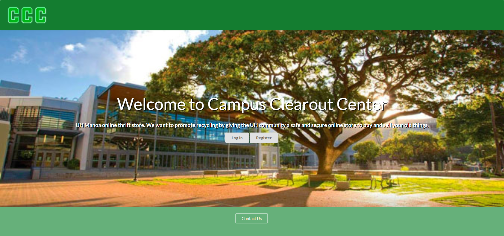

## Overview
For our final project for my software development class, my 3 groupmates and I worked on a website called Campus Clearout Center. Campus Clearout Center is a website that allows UH community members to offer their items they don't want while searching for items that other people are giving away. Having a trading website for UH community members allows reusable materials like textbooks, campus specific necessities, and more to be distributed by other members of the UH community so that the material is not thrown away. This website also allows users to choose certain locations on UH campus so that trades may be done in a safe and secure environment. 

## Contributions
Since this project was made in one month, it was also split into 3 milestones. My group mates and I made a range of 11-13 issues for each milestone that can be split among the 4 of us. For the first milestone, I worked on the user home page and the admin home page when the user/admin logs in. For the second milestone, I worked on the report feature and the report list for the admins to view. For the third milestone, I worked on the delete function so that reports and items can be deleted by the admins, implemented a listall for users to see, code clean up, "more details" section of each item, a bit of website improvement based on community feedback,  and test cases of the pages/features that I worked on. 

## Conclusion
I really liked this project because of how well communicated everyone was and how much work we all got done as a team. The application called "discord" which is a common messaging platform was very helpful with communication with one another. We were able to report changes to the website, merges to github, and meeting times instantly on the platform. It also taught me a bit about leadership and preparation since it has shown me how to bring everyone back on topic and prepare some notes on what to talk about in each meeting. This project has also taught me about merge conflicts when it comes to using github in group projects instead of solo projects. Overall this project has taught me a mixture of teamwork, communication, a bit of leadership, and software development.

Here is how our [website](https://campus-clearout-center.github.io/) works.
